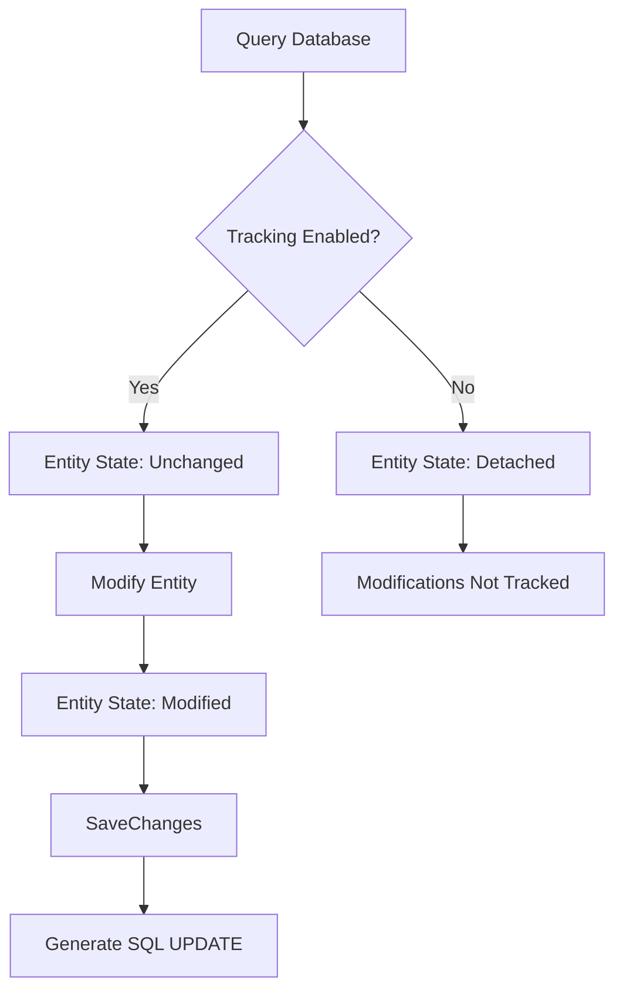
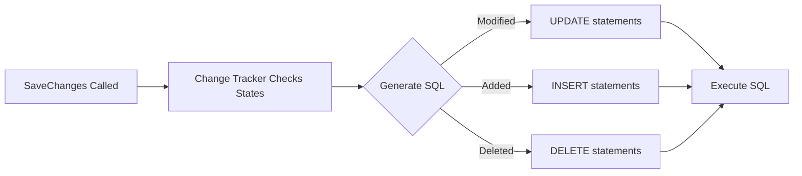
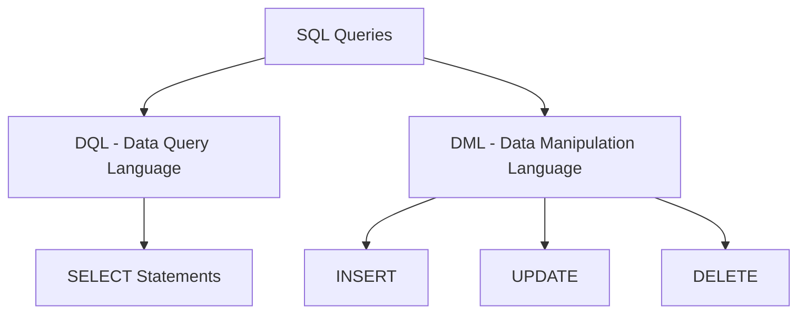

# Entity Framework Core Change Tracker

## Overview
The Change Tracker is a crucial component in Entity Framework Core that monitors the state of entities retrieved from the database. It plays a vital role in detecting changes and managing how these changes are persisted back to the database.

## Entity States
| State | Description |
|-------|-------------|
| Unchanged | Entity was retrieved from database and no modifications made |
| Modified | Entity was retrieved and changes were made to its properties |
| Added | New entity marked for insertion into database |
| Deleted | Entity marked for deletion from database |
| Detached | Entity is not being tracked by Change Tracker |

## Change Tracking Behavior



## Code Examples

### Default Tracking Behavior
```csharp
// Default behavior - with tracking
var employee = (from E in dbContext.Employees
                where E.Id == 1 
                select E).FirstOrDefault();

Console.WriteLine(dbContext.Entry(employee).State);  // Outputs: Unchanged

employee.Name = "Hmada";
Console.WriteLine(dbContext.Entry(employee).State);  // Outputs: Modified

// Persist changes to database
dbContext.SaveChanges();
```

### NoTracking Behavior
```csharp
// No tracking query
var employee = (from E in dbContext.Employees
                where E.Id == 1 
                select E).AsNoTracking().FirstOrDefault();

Console.WriteLine(dbContext.Entry(employee).State);  // Outputs: Detached

employee.Name = "Hambozo";
Console.WriteLine(dbContext.Entry(employee).State);  // Outputs: Detached
```

## Configuring Default Tracking Behavior

You can configure the default tracking behavior for the entire context:

```csharp
// Disable tracking for all queries
dbContext.ChangeTracker.QueryTrackingBehavior = QueryTrackingBehavior.NoTracking;

// Reset to default (tracking enabled)
dbContext.ChangeTracker.QueryTrackingBehavior = QueryTrackingBehavior.TrackAll;
```

## When to Use Each Tracking Mode

### Use Tracking (Default) When:
- You need to modify entities
- You're performing CRUD operations
- You need to track changes for eventual persistence
- Working with related entities that need updating

### Use NoTracking When:
- Performing read-only operations
- Building report queries
- You don't need to update the data
- Optimizing performance is crucial
- Working with large result sets

## Performance Considerations

| Tracking Mode | Memory Usage | Performance | Use Case |
|--------------|--------------|-------------|-----------|
| Tracking | Higher | Slower | CRUD Operations |
| NoTracking | Lower | Faster | Read-only Operations |

## SaveChanges Process



## Best Practices
1. Use NoTracking for read-only scenarios to improve performance
2. Enable tracking only when necessary for modifications
3. Consider setting context-level tracking behavior for consistent usage
4. Be aware of tracking impact when working with large datasets
5. Use appropriate tracking mode based on your use case


# Executing Raw SQL Queries in Entity Framework Core

## Table of Contents
- [SQL Query Types](#sql-query-types)
- [Query Execution Methods](#query-execution-methods)
- [Select Statement Execution](#select-statement-execution)
- [DML Statement Execution](#dml-statement-execution)
- [Best Practices](#best-practices)

## SQL Query Types



## Query Execution Methods

### 1. Select Statements (DQL)
- `FromSqlRaw()`
- `FromSqlInterpolated()`

### 2. DML Statements
- `ExecuteSqlRaw()`
- `ExecuteSqlInterpolated()`

## Select Statement Execution

### Basic Select Query
```csharp
using NorthwindContext dbContext = new NorthwindContext();

// Method 1: FromSqlRaw
var categories = dbContext.Categories
    .FromSqlRaw("Select * from Categories");

foreach (var category in categories)
{
    Console.WriteLine(category.CategoryName);
}
```

### Parameterized Queries

```csharp
// Method 1: Using String.Format
int count = 3;
var categories = dbContext.Categories
    .FromSqlRaw("Select top({0}) * from Categories", count);

// Method 2: Using String Interpolation
var categoriesInterpolated = dbContext.Categories
    .FromSqlInterpolated($"Select top({count}) * from Categories");
```

## DML Statement Execution

```csharp
// Update using ExecuteSqlRaw
dbContext.Database.ExecuteSqlRaw(
    "Update Categories Set CategoryName = 'Hamada' Where CategoryId = 2");

// Update using ExecuteSqlInterpolated
string newName = "Hamada";
int categoryId = 2;
dbContext.Database.ExecuteSqlInterpolated(
    $"Update Categories Set CategoryName = {newName} Where CategoryId = {categoryId}");
```

## Method Comparison

| Method | Usage | Parameter Handling | SQL Injection Protection |
|--------|-------|-------------------|------------------------|
| FromSqlRaw | Select queries with manual parameters | Manual using {0}, {1} | Manual |
| FromSqlInterpolated | Select queries with interpolation | Automatic with $ | Automatic |
| ExecuteSqlRaw | DML operations with manual parameters | Manual using {0}, {1} | Manual |
| ExecuteSqlInterpolated | DML operations with interpolation | Automatic with $ | Automatic |

## Code Examples

### Select Queries
```csharp
// 1. Basic Select
var allCategories = dbContext.Categories
    .FromSqlRaw("Select * from Categories");

// 2. Parameterized Select
int limitCount = 3;
var topCategories = dbContext.Categories
    .FromSqlRaw("Select top({0}) * from Categories", limitCount);

// 3. Interpolated Select
var topCategoriesInterpolated = dbContext.Categories
    .FromSqlInterpolated($"Select top({limitCount}) * from Categories");
```

### DML Operations
```csharp
// 1. Basic Update
dbContext.Database.ExecuteSqlRaw(
    "Update Categories Set CategoryName = 'New Name' Where CategoryId = 1");

// 2. Parameterized Update
string categoryName = "Updated Name";
int id = 2;
dbContext.Database.ExecuteSqlRaw(
    "Update Categories Set CategoryName = {0} Where CategoryId = {1}",
    categoryName, id);

// 3. Interpolated Update
dbContext.Database.ExecuteSqlInterpolated(
    $"Update Categories Set CategoryName = {categoryName} Where CategoryId = {id}");
```

## Best Practices

1. **Use Interpolated Methods When Possible**
   - Better parameter handling
   - Automatic SQL injection protection
   - Cleaner syntax

2. **Parameter Handling**
   ```csharp
   // Good
   var param = "SomeValue";
   dbContext.Database.ExecuteSqlInterpolated(
       $"Update Categories Set Name = {param}");

   // Avoid
   dbContext.Database.ExecuteSqlRaw(
       $"Update Categories Set Name = '{param}'"); // SQL Injection risk
   ```

3. **Query Organization**
   - Keep SQL queries in separate constants/files
   - Use meaningful variable names
   - Document complex queries

4. **Error Handling**
   ```csharp
   try
   {
       var result = dbContext.Categories
           .FromSqlInterpolated($"Select * from Categories");
   }
   catch (Exception ex)
   {
       // Handle database errors
   }
   ```

## Security Considerations

1. **SQL Injection Prevention**
   - Always use parameterized queries
   - Prefer interpolated methods
   - Never concatenate user input directly

2. **Access Control**
   - Limit raw SQL usage
   - Use stored procedures when possible
   - Implement proper authentication/authorization

---
