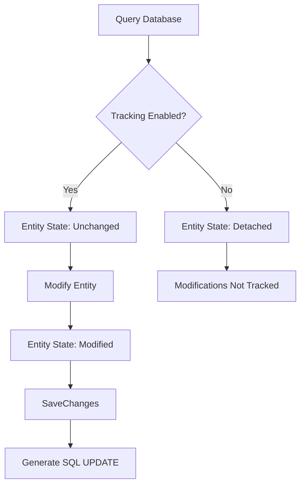
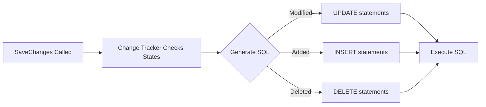

# Entity Framework Core Change Tracker

## Overview
The Change Tracker is a crucial component in Entity Framework Core that monitors the state of entities retrieved from the database. It plays a vital role in detecting changes and managing how these changes are persisted back to the database.

## Entity States
| State | Description |
|-------|-------------|
| Unchanged | Entity was retrieved from database and no modifications made |
| Modified | Entity was retrieved and changes were made to its properties |
| Added | New entity marked for insertion into database |
| Deleted | Entity marked for deletion from database |
| Detached | Entity is not being tracked by Change Tracker |

## Change Tracking Behavior



## Code Examples

### Default Tracking Behavior
```csharp
// Default behavior - with tracking
var employee = (from E in dbContext.Employees
                where E.Id == 1 
                select E).FirstOrDefault();

Console.WriteLine(dbContext.Entry(employee).State);  // Outputs: Unchanged

employee.Name = "Hmada";
Console.WriteLine(dbContext.Entry(employee).State);  // Outputs: Modified

// Persist changes to database
dbContext.SaveChanges();
```

### NoTracking Behavior
```csharp
// No tracking query
var employee = (from E in dbContext.Employees
                where E.Id == 1 
                select E).AsNoTracking().FirstOrDefault();

Console.WriteLine(dbContext.Entry(employee).State);  // Outputs: Detached

employee.Name = "Hambozo";
Console.WriteLine(dbContext.Entry(employee).State);  // Outputs: Detached
```

## Configuring Default Tracking Behavior

You can configure the default tracking behavior for the entire context:

```csharp
// Disable tracking for all queries
dbContext.ChangeTracker.QueryTrackingBehavior = QueryTrackingBehavior.NoTracking;

// Reset to default (tracking enabled)
dbContext.ChangeTracker.QueryTrackingBehavior = QueryTrackingBehavior.TrackAll;
```

## When to Use Each Tracking Mode

### Use Tracking (Default) When:
- You need to modify entities
- You're performing CRUD operations
- You need to track changes for eventual persistence
- Working with related entities that need updating

### Use NoTracking When:
- Performing read-only operations
- Building report queries
- You don't need to update the data
- Optimizing performance is crucial
- Working with large result sets

## Performance Considerations

| Tracking Mode | Memory Usage | Performance | Use Case |
|--------------|--------------|-------------|-----------|
| Tracking | Higher | Slower | CRUD Operations |
| NoTracking | Lower | Faster | Read-only Operations |

## SaveChanges Process



## Best Practices
1. Use NoTracking for read-only scenarios to improve performance
2. Enable tracking only when necessary for modifications
3. Consider setting context-level tracking behavior for consistent usage
4. Be aware of tracking impact when working with large datasets
5. Use appropriate tracking mode based on your use case
